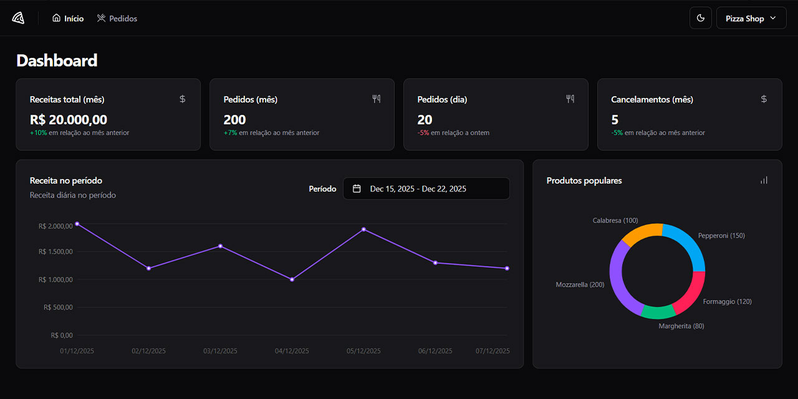

# 🍕 Pizza Shop Web

> Dashboard administrativo para gerenciamento de pizzarias, focado em performance e experiência do usuário.

<p align="center">
  
</p>

## 📋 Sobre o Projeto

O **Pizza Shop Web** é uma aplicação completa de dashboard desenvolvida para facilitar a gestão de pedidos e entregas de uma pizzaria. O projeto foca em conceitos avançados do ecossistema React, incluindo gerenciamento de estado complexo, roteamento, formulários validados e uma estratégia robusta de testes.

## ✨ Funcionalidades

- [x] **Dashboard:** Métricas de receitas, pedidos e cancelamentos (diário/mensal).
- [x] **Gestão de Pedidos:** Listagem, filtragem e alteração de status em tempo real.
- [x] **Autenticação:** Fluxo de login via Magic Link.
- [x] **Perfil:** Gerenciamento de informações do estabelecimento.
- [x] **Interface Responsiva:** Design otimizado para diferentes tamanhos de tela.
- [x] **Dark/Light Mode:** Suporte a temas persistentes.

## 🛠️ Tecnologias e Ferramentas

- **Core:** [React 19](https://react.dev/), [TypeScript](https://www.typescriptlang.org/), [Vite](https://vitejs.dev/)
- **Estado & Data Fetching:** [TanStack Query (React Query)](https://tanstack.com/query/latest)
- **Roteamento:** [React Router DOM](https://reactrouter.com/)
- **Formulários:** [React Hook Form](https://react-hook-form.com/) + [Zod](https://zod.dev/)
- **Styling:** [Tailwind CSS](https://tailwindcss.com/) + [shadcn/ui](https://ui.shadcn.com/)
- **Testes:**
  - **Unitários:** [Vitest](https://vitest.dev/) & [Testing Library](https://testing-library.com/)
  - **E2E:** [Playwright](https://playwright.dev/)
  - **Mocks:** [MSW (Mock Service Worker)](https://mswjs.io/)

## 🚀 Como Começar

### Pré-requisitos

- Node.js >= 22.0.0
- npm ou yarn

### Instalação

```bash
# Clone o repositório
git clone https://github.com/Robson16/pizza-shop-web.git

# Entre no diretório
cd pizza-shop-web

# Instale as dependências
npm install
```

### Variáveis de ambiente

O projeto fornece um arquivo de exemplo e um arquivo de ambiente para modo de teste:

- `.env.example` — exemplo de variáveis (use como base)
- `.env.local` — variáveis para desenvolvimento local
- `.env.test` — usado pelo modo de teste (ex.: `VITE_API_URL="/"`, `VITE_ENABLE_API_DELAY=false`, `VITE_USE_MOCKS=true`)

Exemplos:

`.env.example`

```
VITE_API_URL="http://localhost:3333"
VITE_ENABLE_API_DELAY=true
VITE_USE_MOCKS=false
```

`.env.test`

```
VITE_API_URL="/"
VITE_ENABLE_API_DELAY=false
VITE_USE_MOCKS=true
```

### Scripts Disponíveis

```bash
# Inicia o servidor de desenvolvimento
npm run dev

# Inicia o servidor de desenvolvimento em modo de teste (porta usada nos e2e)
npm run dev:test

# Executa os testes end-to-end (Playwright). O Playwright inicia o servidor de teste automaticamente.
npm run dev:test:e2e

# Testes unitários (Vitest)
npm test

# Constrói a aplicação para produção
npm run build

# Visualiza a versão de produção
npm run preview

# Executa o linter
npm run lint

# Corrige problemas de linting automaticamente
npm run lint:fix

# Formata o código
npm run format

# Verifica se o código está formatado corretamente
npm run format:check
```

## 🧪 Testes

- Unitários: `vitest` (executar `npm test`).
- E2E: `@playwright/test`. Execute `npm run dev:test:e2e` — o Playwright usará o `webServer` configurado em `playwright.config.ts` para iniciar `npm run dev:test` automaticamente.

Dicas para executar Playwright localmente:

```bash
# Executa todos os testes e2e
npm run dev:test:e2e

# Executa em modo debug/headed
npx playwright test --headed --project=chromium

# Abre relatório HTML após execução
npx playwright show-report
```

## 🧩 Mocks e MSW

O projeto usa MSW para simular a API em modo de desenvolvimento/teste. O worker está disponível em `public/mockServiceWorker.js` e os handlers em `src/services/mocks`.

## 📁 Estrutura do Projeto

```
src/
├── App.tsx            # Componente raiz
├── global.css         # Estilos globais
├── main.tsx           # Ponto de entrada
├── routes.tsx         # Definição de rotas
├── assets/            # Recursos estáticos
├── components/        # Componentes reutilizáveis
│   ├── theme/         # Gerenciamento de tema
│   └── ui/            # Componentes de UI
├── lib/               # Funções utilitárias
├── pages/             # Páginas da aplicação
│   ├── _layouts/      # Layouts principais
│   ├── app/           # Páginas autenticadas
│   │   ├── dashboard/ # Módulo de dashboard
│   │   └── orders/    # Módulo de pedidos
│   └── auth/          # Páginas de autenticação
├── services/          # Serviços de integração com API
tests/                 # Testes end-to-end (Playwright)
```

## 🔐 Autenticação

O projeto implementa um sistema de autenticação com layouts separados:

- **AuthLayout** - Para páginas de login
- **AppLayout** - Para páginas do dashboard (autenticadas)

## 🖥️ Backend

O backend da aplicação está disponível em um repositório separado, desenvolvido com Bun, Elysia, Drizzle ORM, TypeScript e outras tecnologias modernas. Ele oferece autenticação, gerenciamento de pedidos, clientes e integração com banco de dados PostgreSQL.

- Repositório: [Robson16/pizza-shop-api](https://github.com/Robson16/pizza-shop-api)

## 📄 Licença

Este projeto está sob a licença MIT. Veja o arquivo LICENSE para mais detalhes.

---

Feito com 💜 por [Robson H. Rodrigues](https://github.com/Robson16/)
